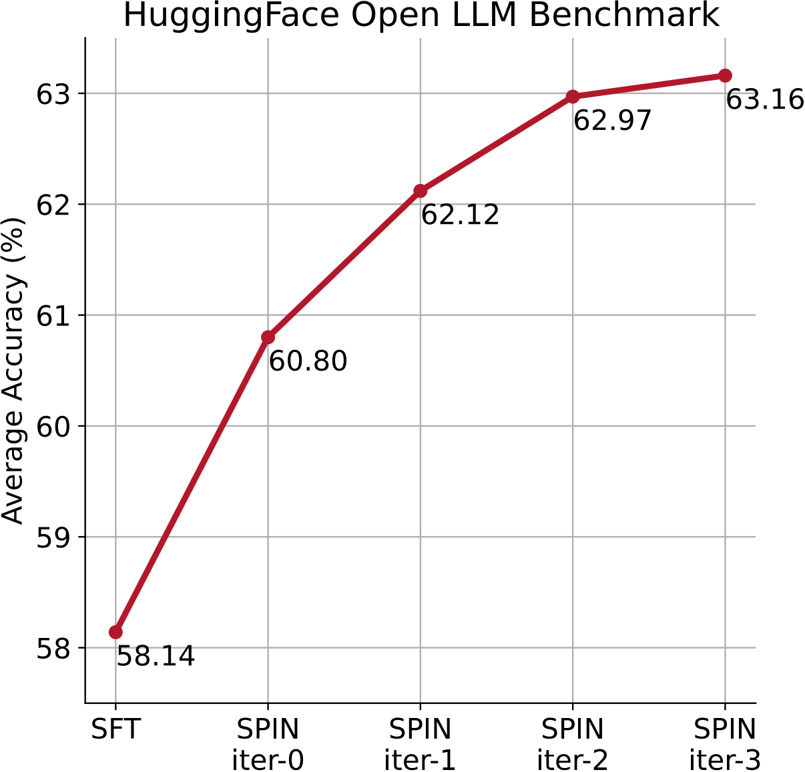
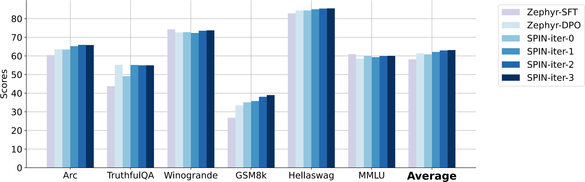

<p align="center">
     <br>
</p>
<p align="center">
    🤗 <a href="https://huggingface.co/collections/UCLA-AGI/zephyr-7b-sft-full-spin-65c361dfca65637272a02c40" target="_blank">Models</a> | 🤗 <a href="https://huggingface.co/collections/UCLA-AGI/datasets-spin-65c3624e98d4b589bbc76f3a" target="_blank">Datasets</a>
</p>

# Self-Play Fine-Tuning (SPIN)

  

This repository contains the official code for the paper "[Self-Play Fine-Tuning Converts Weak Language Models to Strong Language Models](https://arxiv.org/abs/2401.01335)".

Authors: [Zixiang Chen](https://sites.google.com/view/zxchen)\*, [Yihe Deng](https://sites.google.com/g.ucla.edu/yihedeng/)\*, [Huizhuo Yuan](https://scholar.google.com/citations?user=8foZzX4AAAAJ)\*, [Kaixuan Ji](https://scholar.google.com/citations?user=FOoKDukAAAAJ), [Quanquan Gu](https://web.cs.ucla.edu/~qgu/)

[[Webpage](https://uclaml.github.io/SPIN/)] [[Huggingface](https://huggingface.co/papers/2401.01335)] 


## 🔔 News 
- **[05/01/2024]** SPIN has been accepted by ICML2024!
- **[04/06/2024]** We released the training scripts to reproduce our results.
- **[04/04/2024]** ❗ We've discovered that the datasets previously uploaded are incorrect. We've re-upload the corrected datasets.
- **[02/13/2024]** We updated our arXiv v2: https://arxiv.org/abs/2401.01335.
- **[02/09/2024]** Our code is open-sourced!
- **[01/02/2024]** Our paper is released on arXiv: https://arxiv.org/abs/2401.01335.

❗ __Note__: We notice that the [Alignment Handbook](https://github.com/huggingface/alignment-handbook) has updated their configuration and SFT checkpoint since our experiments. The configuration and SFT model from the Alignment Handbook that we used in our experiments for data generation and fine-tuning are the older version ([Config](https://github.com/huggingface/alignment-handbook/blob/61a11a5c7d66179ed0a930b0dd12e532fce701dd/recipes/zephyr-7b-beta/dpo/config_full.yaml), [Model](https://huggingface.co/alignment-handbook/zephyr-7b-sft-full/tree/ac6e600eefcce74f5e8bae1035d4f66019e93190)). The model checkpoint on Hugging Face (`alignment-handbook/zephyr-7b-sft-full`) has been updated once with the new config. If you wish to use the newest SFT model, you need to either load the checkpoint with `revision=ac6e600eefcce74f5e8bae1035d4f66019e93190` or generate your own data instead of using the [datasets](https://huggingface.co/collections/UCLA-AGI/datasets-spin-65c3624e98d4b589bbc76f3a) we provided on Hugging Face.


## Table of Contents
- [About SPIN](#🌀-about-spin)
- [Setup](#Setup)
    - [Data](#Data)
    - [Model](#Model)
- [Usage](#Usage)
    - [Step 1: Generation](#step-1-generation)
        - [Faster generation with vLLM](#🚀-faster-generation-with-vllm)
    - [Step 1.5: Gather generations and convert data type](#step-15-gather-generations-and-convert-data-type)
    - [Step 2: Fine-tuning](#step-2-fine-tuning)
- [Reproducing Our Results](#Reproducing-Our-Results)
- [Evaluation](#Evaluation)
- [Citation](#Citation)
- [Acknowledgement](#Acknowledgement)


## 🌀 About SPIN
**SPIN** utilizes a self-play mechanism, allowing an LLM to improve itself by playing against its previous iterations, without needing additional human-annotated preference data than the SFT dataset itself. More specifically, the LLM generates its own training data from its previous iterations, refining its policy by discerning these self-generated responses from the original SFT data. 
<p align="center">
     <br>
  Average score of <b>SPIN</b> at different iterations on the HuggingFace Open LLM leaderboard. 
</p>
SPIN can significantly enhance the performance of an LLM after SFT across various benchmarks, outperforming the model trained with direct preference optimization (DPO) on labelled preference datasets. The approach is theoretically grounded, ensuring that the LLM aligns with the target data distribution, and empirically validated through extensive evaluations on multiple datasets. 
<p align="center">
     <br>
  Performance comparison with DPO training across the six benchmark datasets. SPIN at iteration 0 achieves comparable performance to DPO training with 62k new data. At iteration 1, SPIN has already surpassed DPO training on the majority of datasets. 
</p>

For more details, you can check our paper [here](https://arxiv.org/abs/2401.01335).

## Setup
The following steps provide the necessary setup to run our codes.
1. Create a Python virtual environment with Conda:
```
conda create -n myenv python=3.10
conda activate myenv
```
2. Install the following Python dependencies to run the codes.
```
python -m pip install .
python -m pip install flash-attn --no-build-isolation
```
3. Login to your huggingface account for downloading models
```
huggingface-cli login --token "${your_access_token}"
```

### Data 
We provide the data used in our experiments along with the synthetic data we generated in this repo as well as on HuggingFace. These data are converted to .parquet format for fine-tuning. 

❗ On 04/04/2024, we've discovered that the datasets previously uploaded are incorrect. We've re-upload the corrected datasets.

| Dataset                    |                           Download                           |
| :----------------------- | :----------------------------------------------------------: |
| SPIN_iter0     | 🤗 [HuggingFace](https://huggingface.co/datasets/UCLA-AGI/SPIN_iter0) |
| SPIN_iter1 | 🤗 [HuggingFace](https://huggingface.co/datasets/UCLA-AGI/SPIN_iter1) |
| SPIN_iter2      |   🤗 [HuggingFace](https://huggingface.co/datasets/UCLA-AGI/SPIN_iter2) |
| SPIN_iter3      |   🤗 [HuggingFace](https://huggingface.co/datasets/UCLA-AGI/SPIN_iter3) |

The input data for our code is required to be of the same format where each data contains the following attributes, as similar to [HuggingFaceH4/ultrafeedback_binarized](https://huggingface.co/datasets/HuggingFaceH4/ultrafeedback_binarized):
```
{
    "real": [{"role": "user", "content": <prompt>}, 
               {"role": "assistant", "content": <ground truth>}],
    "generated": [{"role": "user", "content": <prompt>}, 
                 {"role": "assistant", "content": <generation>}]
}
```
🔍 Note: During data generation, the content for generated response can be empty, as we only uses prompt to generate model responses. 

### Model
We also provide our model checkpoints at iteration 0,1,2,3 on HuggingFace.

| Model                    |                           Download                           |
| :----------------------- | :----------------------------------------------------------: |
| zephyr-7b-sft-full-SPIN-iter0     | 🤗 [HuggingFace](https://huggingface.co/UCLA-AGI/zephyr-7b-sft-full-SPIN-iter0) |
| zephyr-7b-sft-full-SPIN-iter1 | 🤗 [HuggingFace](https://huggingface.co/UCLA-AGI/zephyr-7b-sft-full-SPIN-iter1) |
| zephyr-7b-sft-full-SPIN-iter2      |   🤗 [HuggingFace](https://huggingface.co/UCLA-AGI/zephyr-7b-sft-full-SPIN-iter2) |
| zephyr-7b-sft-full-SPIN-iter3     |   🤗 [HuggingFace](https://huggingface.co/UCLA-AGI/zephyr-7b-sft-full-SPIN-iter3) |

🔍 __Note__: <span style="color:red;">With the provided data, you can directly jump to [Step 2: Fine-tuning](#step-2-fine-tuning) without doing data generation on your own. You may also start from any iteration to reproduce our results using our open-sourced model checkpoints.</span>

## Usage
For SPIN, we generate all synthetic data at once for an iteration, and fine-tune the LLM based on the real and synthetic data pairs. 

### Step 0 (optional): Reformatting SFT dataset
```
python spin/reformat.py [options]
```
Options
- `--data`: directory to the SFT dataset (local or huggingface)
    - default: `HuggingFaceH4/ultrachat_200k`
- `--output_dir`: local directory to the reformated data files 
    - default: `UCLA-AGI/SPIN_iter0`

🔍 Note: If choosing to use SPIN on the entire dataset of `HuggingFaceH4/ultrachat_200k` instead of our 50k subset, one can reformat the original data with `spin/reformat.py`. To use other datasets, simply convert the data into the same format and resume with the following steps. 

### Step 1: Generation
```
accelerate launch spin/generate.py [options]
```
Options
- `--model`: load model checkpoint for generation.
    - default: `alignment-handbook/zephyr-7b-sft-full`
- `--input_dir`: directory to the data files with prompts for generation
    - The code is for generation based on data of the format given below. 
    - default: `UCLA-AGI/SPIN_iter0`
- `--output_dir`: directory to save the output data. 
- `--batch_size`: per device batch size
    - default: 16
- `--data_frac`: break data into fractions for generations across server.
    - `--frac_len`: length of the data fraction. Default is 0 which uses the entire dataset for generation. Set `frac_len` to a positive number to generate only for a fraction of data. __Note__: we recommend using a smaller frac_len (e.g. 800) to generate data by small batches to avoid unexpected crashes as data generation can be very time-consuming.  
    - Setting `data_frac` to be 0, 1, 2... to generate for different fractions of length `frac_len`.
    - Note: maintain the same frac length when doing generation using data_frac. It's recommended to set a smaller `frac_len` to 800.
- `--split`: choose the split for data generation
    - default: `train`

The generated data is in json format where each data contains the following attributes:
```
{
    "real": [{"role": "user", "content": <prompt>}, 
               {"role": "assistant", "content": <ground truth>}],
    "generated": [{"role": "user", "content": <prompt>}, 
                 {"role": "assistant", "content": <generation>}]
}
```

**Note**: the iteration number for data generation solely depends on which model is used for generation (e.g. use original SFT model for iter0 data generation and SPIN iter0 model for iter1 data generation). The `generate.py` script will only use the prompts/questions for the data model.  

__Example__. 
The following code generates 8k synthetic data for iteration 0.
```
bash scripts/generate.sh
``` 

#### 🚀 Faster generation with vLLM
Alternatively, you could use the following example script to generate LLM responses with speedup. Larger `frac_len` can be used with vllm.
```
bash scripts/generate_vllm.sh
```  
Thanks to @sumo43 for implementing vLLM for generation. 

### Step 1.5: Gather generations and convert data type
```
python spin/convert_data.py [options]
```
Options
- `--num_fracs`: number of files to load in.
- `--input_dir`: directory to the generated data files.
- `--output_dir`: directory for the unified data that will be used for fine-tuning. 

The code will generate the two final data files including `train_prefs-00000-of-00001.parquet` and `test_prefs-00000-of-00001.parquet`, which will be used for fine-tuning.

Note: make sure to collect the generated data filed into the same directory of `--input_dir`. 

__Example__.
```
python spin/convert_data.py --output_dir new_data/iter0 --input_dir generated/iter0 --num_fracs 63
```

### Step 2: Fine-tuning
```
accelerate launch --config_file configs/multi_gpu.yaml --num_processes=8 --main_process_port 29500 spin/run_spin.py configs/config.yaml
```
<!-- **[TODO]**: wrap up necessary codes into the folder spin. Add explainations/instructions here.  -->

You might need to change the configuration in `configs/config.yaml`. Here are some key configs you might need to customize:

- `model_name_or_path`: load model checkpoint for finetuning.
    - default: `alignment-handbook/zephyr-7b-sft-full`
- `dataset_mixer`: choose data to mix for fine-tuning.
    - default: `UCLA-AGI/SPIN_iter0: 1.0`
    - For SPIN at iteration 1 and 2, we included both the current iteration and the previous iteration (e.g. for iteration 1 we included both `UCLA-AGI/SPIN_iter0: 1.0` and `UCLA-AGI/SPIN_iter1: 1.0`, summing to 100k data.)
- `output_dir`: the output directory of finetuned model and checkpoints. 
    - default: `outputs`
- `per_device_train_batch_size`: batch size on one GPU.
    - default: 16
- `gradient_accumulation_steps`: make sure that the product per_device_train_batch_size\*num_processes\*gradient_accumulation_steps equals to your true batch size.
- `num_train_epochs`: the training epochs of this iteration.
    - default: 3
- `beta`: beta in SPIN.
    - default: 0.1

In our experiments, we do full fine-tuning on a multi-GPU machine with DeepSpeed ZeRO-3 (requires A100 (80GB)).

__Example__.
```
bash scripts/finetune.sh
```
## Reproducing Our Results

To help reproducing our results, we have made available the scripts corresponding to all four iterations of our study. These scripts are pre-configured with the exact parameters and model versions used in our paper. For each iteration, the base model is initialized with the version released on 🤗 HuggingFace, which can be found at the following links:

| Dataset                    |                           Download                           |
| :----------------------- | :----------------------------------------------------------: |
| SPIN_iter0     | 🤗 [HuggingFace](https://huggingface.co/datasets/UCLA-AGI/SPIN_iter0) |
| SPIN_iter1 | 🤗 [HuggingFace](https://huggingface.co/datasets/UCLA-AGI/SPIN_iter1) |
| SPIN_iter2      |   🤗 [HuggingFace](https://huggingface.co/datasets/UCLA-AGI/SPIN_iter2) |
| SPIN_iter3      |   🤗 [HuggingFace](https://huggingface.co/datasets/UCLA-AGI/SPIN_iter3) |

To execute the full pipeline using your locally trained models as the base, modify the `model_name_or_path` parameter in the configuration files to point to your model's path.

To start the full fine-tuning process, run the corresponding script from your terminal:

```bash
bash scripts/finetune.sh
bash scripts/finetune_iter1.sh
bash scripts/finetune_iter2.sh
bash scripts/finetune_iter3.sh
```

By following these steps, you should be able to reproduce our results.

---

## Evaluation
For our evaluation on the Open LLM Leaderboard, please use this [lm-evaluation-harness](https://github.com/EleutherAI/lm-evaluation-harness/tree/46c796644913cd99da7eee868e64f9ed6af33407) which is v0.4.0. Also, note that we set the number of few shot examples to be the same as instructed on the [Leaderboard](https://huggingface.co/spaces/HuggingFaceH4/open_llm_leaderboard). Different evaluation versions results in different scores, but the trend will remain the same.


## Star History

[](https://star-history.com/#uclaml/SPIN&Date)

## Citation
If you find this repo useful for your research, please consider citing the paper
```
@misc{chen2024selfplay,
      title={Self-Play Fine-Tuning Converts Weak Language Models to Strong Language Models}, 
      author={Zixiang Chen and Yihe Deng and Huizhuo Yuan and Kaixuan Ji and Quanquan Gu},
      year={2024},
      eprint={2401.01335},
      archivePrefix={arXiv},
      primaryClass={cs.LG}
}
```

## Acknowledgement
This repo is built upon [The Alignment Handbook](https://github.com/huggingface/alignment-handbook). We thank the authors for their great work.
